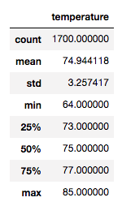
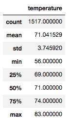

# Surf Shop

# Ride Sharing Data by City Type -- Overview
We've been tasked with analyzing June and December temperature trends to help determine whether it makes sense to keep the surf shop opened year-round.  

## Resources
- Software: Python 3.7.6, Jupyter Notebook
- SQLite, SQLAlchemy, and Flask

## Summary
As shown in the summary tables below, while there is a slight dip in temperature in December, it is likely still warm enough, on average to support, an ice-cream shop. Three key takeaways:
  - mean temperature in June is 77 degrees versus 71 degrees in December.
  - There is slighlty more variation in the December data versus the June data, but not much.  The standard deviation in June, for example, versus December is 2.6 degrees versus 3.4 degrees, respectively.
  - June min temp was 71 degrees versus 60 degrees for December data.  

## Recommendations
Two additional queries that could be run would be to assess rain levels in both months and percent of days that were sunny versus cloudy.     
